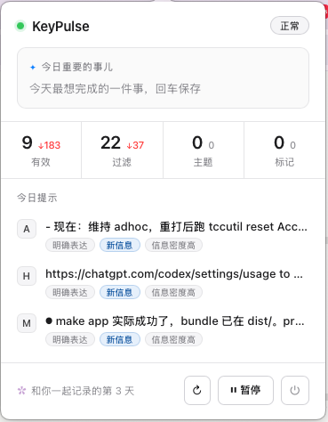

# KeyPulse·笔友

> **A pen-pal for the way you work — it notices the small inputs of your day, forgets the secrets before they land, and each evening leaves you a note in Obsidian.**

KeyPulse is a local-first companion for macOS. It watches the quiet surface of your work — the apps you switch between, the lines you paste, the windows you keep returning to — and once a day writes back to you inside your own Obsidian vault. Not to score you, not to do your work for you. To accompany you in **recording, organizing, and growing** — so the days don't disappear into the stream, and the patterns underneath them slowly come into view.

The vision in one line: *a quiet partner that watches the details, keeps none of the secrets, and helps you become a little sharper every day.*

*[中文版 → README.md](README.md)*

[](https://www.python.org/downloads/)
[](https://www.apple.com/macos/)
[](tests/)
[](LICENSE)

---

## Why this exists

Most activity trackers fall into one of three traps:

- **Dashboards** — beautiful graphs that nobody looks at twice
- **Quantified self** — "this week: 87/100" (what do you *do* with that?)
- **AI assistants** — they do your work, so you stop thinking

KeyPulse is none of these. It records the small stuff — app switches, clipboard, window titles — not to score you, but to give a patient observer enough material to eventually write back:

> *"These past three days you kept returning to this terminal — are you stuck on something, or is this the thing you actually want to build?"*

That line doesn't come on Day 1. It comes on **Day 5**, after the system has watched long enough to earn the right to ask.

---

## What it looks like today

<p align="center">
  
</p>

Once installed, KeyPulse lives as **a small window in your menu bar.**

Open it once a day: top-left is *"the thing that matters today"* — the anchor you set yourself in the morning. Below: four numbers showing what's accumulated. Below that: three cards it picked out as worth a second look. The footer line — *"day N of recording with you"* — counts the days you've walked together.

When something breaks, it doesn't throw an error code at you. A yellow bar appears at the top of the HUD with **a button next to it**: *"Accessibility permission missing [Open Settings]"* — one click takes you straight to the right system pane. **A path to fix, not a stack trace.**

The evening summary writes to your own Obsidian vault — the other half of what it slowly grows together with you.

---

## What it is, and what it refuses to be

| It **is** | It **refuses to be** |
|---|---|
| A pen-pal that slowly learns your patterns | A dashboard optimizing for screen-time |
| A mirror for your thinking | A productivity scoreboard |
| Your external memory — so you can revisit past selves | An AI that does work *for* you |
| Local, auditable, on your machine | A SaaS harvesting your focus data |

---

## The voice it speaks in

| ✗ Machine report | ✓ Pen-pal voice |
|---|---|
| `2026-04-21 · 10 events · top theme: terminal` | "You stared at the terminal 11 hours today. A little worried about your back." |
| `Productivity: 87/100` | "You seemed less cheerful this week than last — want to try a different rhythm tomorrow?" |
| `New theme detected` | "Are you working on something new? I can't quite see it yet, but I sense it brewing." |

Every user-facing string is tested against one question: *would a pen-pal write this?* If not, we rewrite it.

---

## What's inside (the engineering)

KeyPulse ships a small stack of things that are harder than they look:

### 🧠 Human/machine **speaker model**
Every event is tagged `speaker: user` (keyboard, clipboard, manual saves) or `speaker: system` (window titles, AX tree, OCR). Daily reports are split into two columns — **what you did** vs. **what the system showed** — so your voice stays the main line, and the machinery never drowns it out.

### 🔒 Privacy, by architecture (not policy text)
- **No keystroke logging** — keyboard watcher records *chunks and boundaries*, never raw keys.
- **35-app default blacklist** — password managers, messengers, banking apps. Entire events dropped before reaching disk.
- **Field-level desensitization** — emails, tokens, API keys, cards masked at normalize time.
- **Camera-aware pause** — when macOS CMIO activates (Zoom, FaceTime, Screen recording), capture pauses automatically.
- **Private-browsing detection** (Safari/Chrome/Firefox incognito windows excluded via AX title inspection).

### ♻️ When something breaks, you get a fix path — not an error code
Background tools die. Permissions get revoked. APIs expire. KeyPulse assumes this and bakes recovery into the design:

- **7 capability domains, each self-checking** — accessibility permission, capture runtime, clipboard watcher, health freshness, LLM backend, and more. Probed every 60s, isolated from each other. When anything fails, the HUD shows **a plain-language reason + one fix button** — never a raw error code that sends you to Google.
- **Hourly incremental Obsidian sync** — cursor-based, dedupe by event identity, **append-safe** (your `## 今日主线` narrative and `## 明天的锚点` tomorrow-plan are never overwritten once written).
- **launchd manages four jobs** — daemon / healthcheck / hourly sync / daily sync. Auto-start on login, auto-restart on crash.

### 📝 Obsidian as the reading surface
Daily notes, event cards, topic cards. Checkbox-based feedback (`- [ ] 确认 [ ] 否掉 [ ] 拆分`) flows back to the pipeline — zero context switch, the report *is* the feedback form.

### 🧪 Quality framework
A **Golden Set** of labeled days keeps the narrative pipeline from silently drifting as we tune thresholds. 800+ tests passing, including regression coverage for the migration that once mislabeled 2,341 user events as system events, plus architectural invariants for the capability framework.

---

## Architecture

```
┌──────────────────────────────────────────────────────────────┐
│  Capture layer                                                │
│  • Window / AX-text / OCR   (speaker: system)                 │
│  • Keyboard-chunk / Clipboard / Manual  (speaker: user)       │
│  • Camera monitor → pauses AX+OCR when CMIO active            │
└────────────────────────────┬─────────────────────────────────┘
                             ▼
┌──────────────────────────────────────────────────────────────┐
│  Privacy layer                                                │
│  • Blacklist (bundle IDs + glob) • Field desensitization      │
└────────────────────────────┬─────────────────────────────────┘
                             ▼
┌──────────────────────────────────────────────────────────────┐
│  Storage — SQLite (raw_events, sessions, FTS5)                │
└────────────────────────────┬─────────────────────────────────┘
                             ▼
┌──────────────────────────────────────────────────────────────┐
│  Pipeline                                                     │
│  • Sessionizer → work-block aggregation (dual-speaker)        │
│  • Topic extraction (user events only)                        │
│  • Narrative render (LLM, with deterministic fallback)        │
└────────────────────────────┬─────────────────────────────────┘
                             ▼
┌──────────────────────────────────────────────────────────────┐
│  Surfaces                                                     │
│  • Obsidian vault (Daily / Events / Topics / Dashboard)       │
│  • Menu-bar HUD (WKWebView · today's focus + fix-path on err) │
│  • CLI (timeline / search / stats / export)                   │
└──────────────────────────────────────────────────────────────┘

       ↑ Capability self-check (60s loop, 7 domains independently probed)
       ↑ launchd orchestrates four jobs:
         daemon  •  healthcheck (10m)  •  obsidian-sync-hourly  •  obsidian-sync-daily
```

---

## Quick start

Three steps to install — after that, it just lives there.

```bash
# 1. Install — one command builds .app into /Applications and registers launchd
git clone https://github.com/Longfellow1/keypulse.git
cd keypulse
make install

# 2. Configure — interactive 3-choice wizard (~2 min)
keypulse setup
#   ├─ Local Ollama   ── offline-first / no-cost
#   ├─ Local LM Studio── prefer a UI for local models
#   └─ Cloud API      ── ARK / DeepSeek / OpenAI; key stored in macOS Keychain

# 3. Grant Accessibility + Screen Recording in System Settings.
#    (The HUD's yellow bar will tell you exactly where to click.)
```

It now lives in your menu bar permanently. Survives reboot, restarted by `launchd` if it crashes. **A day later**, open `Daily/<today>.md` in your Obsidian vault.

> **No model configured? Still runs.** The daemon keeps capturing; only narrative / daily-report features pause until you run `keypulse setup`.

### The commands you'll actually use

| | |
|---|---|
| `keypulse timeline --today` | See today's sessions |
| `keypulse search "<query>"` | Full-text search across your own memory |
| `keypulse obsidian sync --incremental` | Append new events to today's note (runs hourly) |
| `keypulse obsidian sync --yesterday` | Generate yesterday's full narrative (runs at 09:05) |
| `keypulse healthcheck` | Atomic health report (launchd runs it every 10 min) |
| `keypulse purge --app Slack --confirm` | Wipe everything from an app, permanently |

Full CLI reference: `keypulse --help`. First-time configuration details: [docs/setup-onboarding.md](docs/setup-onboarding.md).

---

## Privacy summary

| What's recorded | What's never recorded |
|---|---|
| App names, window titles (outside blacklist) | Raw keystrokes |
| Clipboard text (≤ 2000 chars, deduped) | Anything from password managers / messengers / banking apps |
| Manual `keypulse save` notes | Contents during camera-active meetings |
| Session boundaries, idle periods | Private/incognito browser windows |

All data lives in `~/.keypulse/keypulse.db` on your machine. No cloud, no telemetry, no network — export is explicit.

---

## Philosophy: the three red lines

Before shipping any feature, we ask:

1. Does this **deepen the relationship** or just add a function?
2. Does this text read like a **pen-pal**, or like a **butler reporting receipts**?
3. Will the user feel *"it gets me"* or *"it's bookkeeping me"*?

Miss any one, redesign.

---

## Where it's heading — from notes to methodology

Today, KeyPulse writes you a daily note. Where it's heading is something bigger: **reading the graph that you and it are building together inside Obsidian, and helping you turn pattern into method.**

Obsidian isn't a notebook — it's a graph. As your daily notes, topic cards, and event cards accumulate and link to each other, they form a structure of **how you work, not just what you did**. KeyPulse is designed to eventually live on top of that graph as a patient reader: noticing recurring edges, proposing small hypotheses about how you operate, and inviting you to name them.

The direction points at something like what Karpathy calls *auto-research*, applied personally — not "the model does the research for you," but "the model proposes small questions about how you work, and you answer them." Over time, your answers themselves become the artifact.

Concretely, it eventually sounds like:

| What you did | What KeyPulse eventually says | What it becomes |
|---|---|---|
| Kept returning to one file across five sessions this week | *"This looks like where you **think**, not where you **edit**."* | A named location in your workflow |
| Always opened docs → terminal → editor in that order | *"That might be a warm-up ritual before deep work."* | A pattern you can keep, break, or study |
| Debug sessions always ended with a clipboard snippet saved to a scratch note | *"You seem to be distilling fixes into lessons — want a methodology file for this?"* | A methodology library — **your own** way of thinking, made visible |

End state: KeyPulse doesn't just remember what you did. It helps you notice **how you do things well**, and turn that into something you can return to — and eventually share.

Not generic productivity tips. A library of patterns named by you, shaped by you, evolving with you.

> **Obsidian's graph is the substrate. KeyPulse is the observer that makes it legible.**

---

## Status

- **Platform:** macOS 12+ (Apple Silicon + Intel)
- **Tests:** 800+ passing (pytest, including capability framework architectural invariants)
- **Installable:** `make install` — one-shot, builds .app and registers launchd
- **First-time setup:** `keypulse setup` — interactive 3-choice wizard, ~2 min
- **Roadmap:** quarterly/annual memoir-style recall · cross-device merge · voice-prompted reflection

KeyPulse is early. The pen-pal can hold a conversation about your day; it can't yet hold one about your year. That's next.

---

## License

Apache 2.0 — see [LICENSE](LICENSE).

## Author

Built by [Harland](https://github.com/Longfellow1) · reach out: Harland5588@outlook.com

> *The goal of KeyPulse is not to make you more efficient.*
> *It's to help you recognize who you are — and who you're becoming.*
