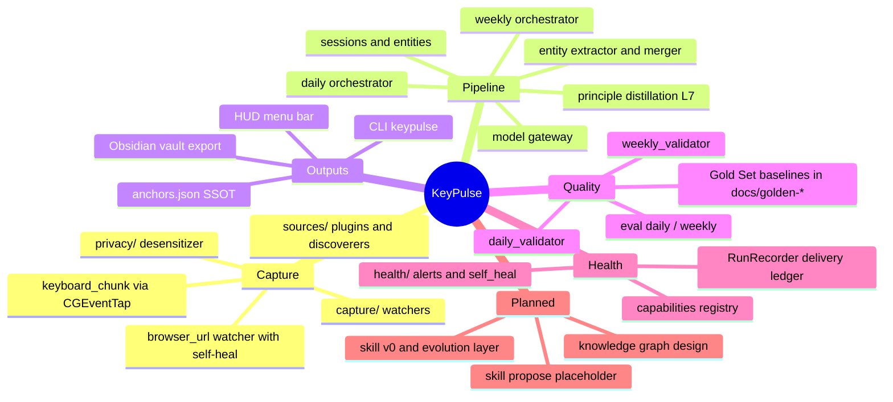

# Feature mindmap

```mermaid
mindmap
  root((KeyPulse))
    Capture
      capture/ watchers
      keyboard_chunk via CGEventTap
      browser_url watcher with self-heal
      sources/ plugins and discoverers
      privacy/ desensitizer
    Pipeline
      sessions and entities
      entity extractor and merger
      daily orchestrator
      weekly orchestrator
      principle distillation L7
      model gateway
    Outputs
      Obsidian vault export
      anchors.json SSOT
      HUD menu bar
      CLI keypulse
    Quality
      daily_validator
      weekly_validator
      Gold Set baselines in docs/golden-*
      eval daily / weekly
    Health
      health/ alerts and self_heal
      capabilities registry
      RunRecorder delivery ledger
    Planned
      knowledge graph design
      skill v0 and evolution layer
      skill propose placeholder
```
